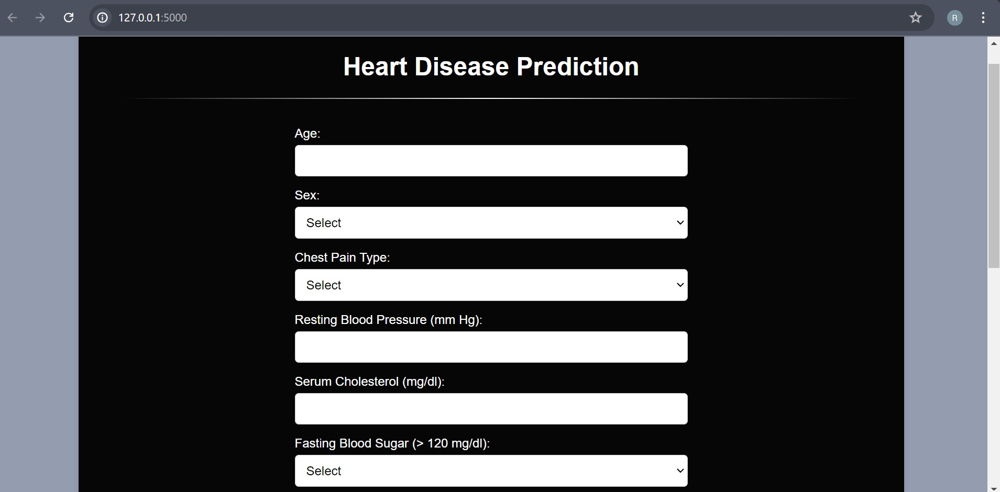
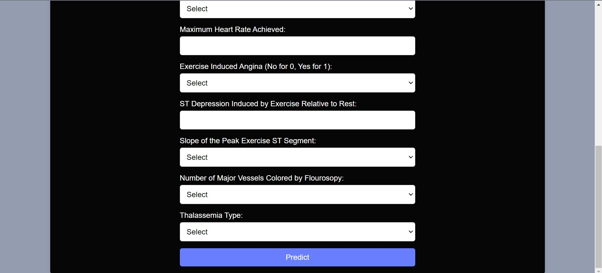

# Heart Disease Prediction
## Project Overview
This project involves building a machine learning model to predict the disease based on heart disease dataset. The system is deployed using Flask, providing an interactive and user-friendly interface for predictions.
## Features
* Data Preprocessing: Handling missing values, encoding categorical data, and scaling features.

* Model Training: Using a Random Forest Regressor for accurate predictions.

* Deployment: Implemented with Flask for an interactive interface.

## Technology Used
* Python

* Jupyter Notebook

* NumPy

* Pandas

* Scikit-learn

* Flask
## Model Training
A Random Forest Regressor and logistic regression is used for training the model. The dataset is split into training and testing sets with a ratio of 80:20.
## Deployment With Flask
Flask is used to create an interactive interface where users can input symptoms and receive predictions about the diseases they might have. The application takes inputs for
* age
* sex
* cp
* trestbps
* chol
* fbs
* restecg
* thalach
* exang
* oldpeak
* slope
* ca
* thal
## How to Run the Project
#### 1. Clone the Repository:
```bash
  git clone https://github.com/riteshranjan2003/Heart_Disease_Prediction.git
```
#### 2. Install the Required Libraries:
```bash
  pip install pandas numpy scikit-learn Flask
```
#### 3. Run the Flask App:
```bash
  python app.py
```
## Usage
1. Open the Flask app in your browser.
2. Enter the required feature values.
3. Click the 'Predict' button to determine if the person is suffering from heart disease or not.

## Code Structure
* heart_disease_prediction.ipynb: Contains the code for data preprocessing and exploratory data analysis.
* app.py: Contains the Flask application code.


